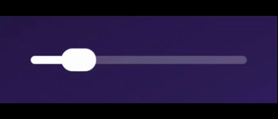
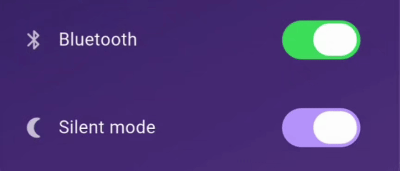

# Liquid Glass Easy

<p align="center">
  <a href="https://pub.dev/packages/liquid_glass_easy"></a>
  <a href="https://pub.dev/packages/liquid_glass_easy/score"></a>
  <a href="https://pub.dev/packages/liquid_glass_easy/score"></a>
  <a href="https://github.com/AhmeedGamil/liquid_glass_easy/blob/main/LICENSE"></a>
</p>

**A Flutter package that adds real-time, interactive liquid glass lenses.**
These dynamic lenses **magnify**, **distort**, **blur**, **tint**, and **refract** the content behind them — creating stunning, glass-like effects that respond fluidly to **movement** and **touch**.

<p>
  
</p>

<p>
  
  
</p>

<p>
  
  
</p>

<p>
  
</p>

---

## What's New in 3.0

Version 3.0 is a major step toward a simpler, more flexible API.

### `LiquidGlassLens` — a lens you can place *anywhere*

The headline change. The previous lens API was **position-driven**: you declared
a `LiquidGlassView`, gave it a `backgroundWidget`, and listed lenses with
explicit `width` / `height` / `position` values.

`LiquidGlassLens` is **layout-driven** instead. Drop it anywhere in your widget
tree — inside a `Row`, a `ListView`, a `Stack`, a `Card` — and it is exactly
where layout puts it and exactly as big as its constraints/child make it. No
position, no width/height parameters.

```dart
SizedBox(
  width: 220,
  height: 120,
  child: LiquidGlassLens(
    style: const LiquidGlassStyle(
      shape: LiquidGlassShape.squircle(cornerRadius: 36),
    ),
    child: const Center(child: Text('glass')),
  ),
)
```

### Works on **both Impeller and Skia**

`LiquidGlassLens` automatically resolves the best render path for the engine
your app is running on — the widget tree you write is **identical** in every
case:

| Engine / setup | Behavior |
|----------------|----------|
| **Impeller** (Flutter's default on modern iOS/Android) | The lens refracts the **live backdrop** — whatever your app painted behind it. **No `LiquidGlassView` and no background widget needed at all.** Just drop the lens over any UI. |
| **Skia** with an ancestor `LiquidGlassView` (+ `backgroundWidget`) | The lens refracts the view's **captured background**, wherever it sits inside the view's `child`. |
| **Skia** without a view | Refraction isn't possible, so the lens gracefully degrades to a **frosted** look (backdrop blur + tint + border) and logs a one-time debug notice. |

> In short: **on Impeller it just works anywhere**; on Skia you wrap your
> content in a `LiquidGlassView` to give the lens a background to refract.

### `LiquidGlassStyle` — one styling vocabulary

Every glass surface — the lens, the components, the nav pill — is described
with a single reusable descriptor: **shape + appearance + refraction**.

```dart
const LiquidGlassStyle(
  shape: LiquidGlassShape.continuousRoundedRectangle(cornerRadius: 24),
  appearance: LiquidGlassAppearance(color: Color(0x22FFFFFF)),
  refraction: LiquidGlassRefraction(distortion: 0.08, distortionWidth: 28),
);
```

### Drop-in glass components

Ready-made widgets, each built on `LiquidGlassLens` with tuned defaults. On
**Impeller** they all refract the live backdrop and work **anywhere** with no
setup. The difference shows on **Skia**: some components refract the *app*
content behind them (so they need an ancestor `LiquidGlassView`), while others
supply their own background and work anywhere on both engines.

- `LiquidGlassButton` — refracts the content behind it. Anywhere on Impeller; on Skia place it inside a `LiquidGlassView` (frosted fallback without one).
- `LiquidGlassSlider` — jelly thumb that refracts the track as it moves. Self-contained: it owns its background, so it works **anywhere** on both Impeller and Skia — no `LiquidGlassView` needed.
- `LiquidGlassToggle` — refracts its own track. Self-contained, so it works **anywhere** on both Impeller and Skia — no `LiquidGlassView` needed.
- `LiquidGlassAppBar` — refracts the content behind it. Anywhere on Impeller; needs a `LiquidGlassView` on Skia.
- `LiquidGlassBottomNavBar` — refracts the content behind it. On Skia, use it inside a `LiquidGlassScaffold` (which provides the `LiquidGlassView`). To place it **anywhere** on Impeller, use the `LiquidGlassBottomNavBar.withImpeller(...)` constructor.
- `LiquidGlassTabBar` — refracts the content behind it. Anywhere on Impeller; needs a `LiquidGlassView` on Skia.
- `LiquidGlassScaffold` — a Scaffold-style layout that owns the glass pipeline (its own `LiquidGlassView`), so its child lenses refract the body **anywhere** on both engines.
- `LiquidGlassDraggable` — a drag wrapper for any lens; inherits whatever the lens it wraps requires.
- `LiquidGlassJelly` — the squash/stretch physics as a reusable widget; inherits whatever the content it wraps requires.

### Why the change?

The old API made you describe a lens as a fixed element, pinned by explicit
`width` / `height` / `position`, inside a `LiquidGlassView` with a
`backgroundWidget`. That fought Flutter's layout model — it wasn't
flexible or scalable for Impeller and Skia, and you always had to supply a
background for Impeller, even though the engine can already render the live
backdrop on its own.

`LiquidGlassLens` flips this around. It is a normal layout widget: it sizes and
positions itself like anything else in the tree, and it's compatible with both
Impeller and Skia. On Impeller it works anywhere — it refracts the live backdrop
with no `LiquidGlassView` and no background widget at all, though you can still
place it inside a `LiquidGlassView` if you want to support Impeller and Skia
together: on Impeller it uses the backdrop filter and on Skia it captures the
background, and the lens handles both automatically. On Skia, wrap it in a
`LiquidGlassView` with a `backgroundWidget` and it refracts that captured
background.

> **Migration note:** the old position-driven lens API (`LiquidGlass`) is
> **no longer used** — it has been replaced by `LiquidGlassLens`. Write new code
> against `LiquidGlassLens` and the drop-in components.

---

## Why Liquid Glass Easy?

Unlike traditional glassmorphism or static blur, **Liquid Glass Easy** simulates
*real glass physics* — complete with **refraction, distortion, and fluid
responsiveness**. It bends live content behind the glass in real time,
producing **immersive, motion-reactive visuals** that bring depth and realism
to your UI.

---

## Features

- **True liquid glass visuals** — real-glass look and physics with fluid transparency, soft highlights, and light-bending refraction.
- **Lens-anywhere** — `LiquidGlassLens` is layout-driven; place it anywhere in the tree with no position/size params.
- **Impeller *and* Skia** — auto-resolved render paths: live backdrop on Impeller, captured background on Skia, frosted fallback otherwise.
- **Real-time lens rendering** — distortion, blur, tint, and refraction react instantly as content moves behind the glass.
- **Custom shapes** — circular rounded rectangles, iOS-style squircles, or Apple-style continuous-corner capsules.
- **Two border modes** — stylized `ClassicBorder` or background-tinted `OpticalBorder`.
- **Drop-in components** — buttons, sliders, toggles, app/tab/nav bars, scaffold.
- **Shader-driven, GPU-accelerated** — smooth, high-FPS performance.
- **Cross-platform** — Android, iOS, Web, macOS, and Windows.

---

## Installation

```yaml
dependencies:
  liquid_glass_easy: ^3.0.0
```

```bash
flutter pub get
```

---

## Getting Started

### 1. The simplest case — a lens, anywhere (Impeller)

On Impeller you don't need a `LiquidGlassView` or a background. Just drop a
`LiquidGlassLens` over your UI:

```dart
import 'package:flutter/material.dart';
import 'package:liquid_glass_easy/liquid_glass_easy.dart';

class DemoGlass extends StatelessWidget {
  const DemoGlass({super.key});

  @override
  Widget build(BuildContext context) {
    return Scaffold(
      body: Stack(
        fit: StackFit.expand,
        children: [
          Image.asset('assets/bg.jpg', fit: BoxFit.cover),
          Center(
            child: SizedBox(
              width: 260,
              height: 150,
              child: LiquidGlassLens(
                style: const LiquidGlassStyle(
                  shape: LiquidGlassShape.squircle(cornerRadius: 44),
                  refraction: LiquidGlassRefraction(
                    distortion: 0.13,
                    distortionWidth: 34,
                  ),
                ),
                child: const Center(child: Text('Liquid Glass')),
              ),
            ),
          ),
        ],
      ),
    );
  }
}
```

### 2. The Skia path — wrap in a `LiquidGlassView`

To make refraction work on Skia, give the lens a background to
refract by placing it inside a `LiquidGlassView.child`:

```dart
LiquidGlassView(
  backgroundWidget: const MyBackground(), // required on Skia
  child: Center(
    child: SizedBox(
      width: 300,
      height: 160,
      child: LiquidGlassLens(
        style: const LiquidGlassStyle(
          shape: LiquidGlassShape.squircle(cornerRadius: 40),
          refraction: LiquidGlassRefraction(distortion: 0.12, distortionWidth: 30),
        ),
        child: const Center(child: Text('refracts the captured background')),
      ),
    ),
  ),
)
```

The exact same `LiquidGlassLens` code refracts the live backdrop on Impeller and
the captured `backgroundWidget` on Skia — no changes required.

### Explore interactively

You can find the demos shown above under the [`example/`](example/) folder.

---

## Core API

### `LiquidGlassLens`

```dart
LiquidGlassLens({
  LiquidGlassStyle style = const LiquidGlassStyle(),
  bool visibility = true,        // instant show/hide; hidden = no backdrop cost
  bool? useImpellerBackdrop,     // override engine auto-detection
  Widget? child,                 // clipped to the lens shape
})
```

Size comes from layout — wrap it in a `SizedBox` (or let its child/constraints
size it). The `child` is always clipped to the full lens shape; add your own
`Padding` to inset it.

### `LiquidGlassStyle`

```dart
LiquidGlassStyle({
  LiquidGlassShape? shape,                // null → default continuous rounded rect
  LiquidGlassAppearance appearance = const LiquidGlassAppearance(),
  LiquidGlassRefraction refraction = const LiquidGlassRefraction(),
})
```

`copyWith(...)` and `merge(other)` are provided for theme/override patterns.

#### `LiquidGlassRefraction`

| Property | Default | Description |
|----------|---------|-------------|
| `distortion` | `0.1` | Bending strength of the distortion (`0.0`–`1.0`). |
| `distortionWidth` | `30` | Thickness of the distortion band around the perimeter, in px. |
| `magnification` | `1.0` | Magnification of content seen through the lens (`1.0` = none). |
| `chromaticAberration` | `0.003` | Color-channel separation; `0.0` disables it. |
| `refractionMode` | `shapeRefraction` | `shapeRefraction` (follows shape contours) or `radialRefraction` (circular pattern). |

#### `LiquidGlassAppearance`

| Property | Default | Description |
|----------|---------|-------------|
| `color` | `transparent` | Base tint of the lens (often semi-transparent). |
| `blur` | `LiquidGlassBlur()` | Blur applied to content beneath the glass. |
| `saturation` | `1.0` | `1.0` = unchanged, `0.0` = grayscale. |
| `enableInnerRadiusTransparent` | `false` | Whether the inner, non-distorted region is transparent. |

#### `LiquidGlassShape`

Pick a corner curve via a convenience constructor:

| Constructor | Corner style |
|-------------|--------------|
| `LiquidGlassShape.roundedRectangle(...)` | Plain **circular** corners (cheapest). |
| `LiquidGlassShape.squircle(...)` | **L^n squircle** — iOS-style continuous curvature. |
| `LiquidGlassShape.continuousRoundedRectangle(...)` | **Apple capsule-style** continuous corners (**default**; collapses to a clean capsule at full radius). |

Common parameters: `cornerRadius`, `borderWidth`, `borderColor`, `lightColor`,
`lightIntensity`, `lightDirection`, `borderType`, and `clipQuality`
(`roundedRectangle` = cheap circular clip, `exact` = shape-matched `ClipPath`).

> **Tip — choosing `clipQuality`:**
> - **`squircle`:** it's worth using `LiquidGlassClipQuality.exact`. The squircle
>   has its own shader-matched `ClipPath`, so `exact` makes the clipped child/blur
>   silhouette follow the true L^n curve instead of a plain rounded rectangle.
> - **`continuousRoundedRectangle`:** leave `clipQuality` at its default
>   (`roundedRectangle`). A rounded-rectangle clip already hugs the continuous
>   corner so closely that there's effectively **no visible difference** from the
>   `exact` continuous clipper — that continuous clipper is only there as an
>   experiment, and `exact` just adds an extra (more expensive) save layer for no
>   real gain. Only reach for `exact` here if you can actually *see* the clipped
>   edge not lining up with the refraction.

### `LiquidGlassView` (Skia background provider)

```dart
LiquidGlassView({
  required Widget backgroundWidget,  // refracted by lenses on Skia
  Widget? child,                     // your UI, containing LiquidGlassLens widgets
  double pixelRatio = 1.0,
  bool realTimeCapture = true,
  bool useSync = true,
  bool? useImpellerBackdrop,
  LiquidGlassRefreshRate refreshRate = LiquidGlassRefreshRate.deviceRefreshRate,
})
```

---

## Border Modes

Every shape renders its border in one of two styles through `borderType`.

| Mode | Description |
|------|-------------|
| `ClassicBorder` | Light/shadow colors sweep around the shape based on the angle between the surface normal and the light direction. Clean, stylized, direct color control. |
| `OpticalBorder` | **(default)** An Apple-style, SDF-based rim light that emerges as an optical consequence of the glass shape — background-tinted highlights, dual-sided specular reflections, and a lens height profile. The rim color adapts to whatever sits behind the lens. |

### Optical Border

```dart
LiquidGlassLens(
  style: const LiquidGlassStyle(
    shape: LiquidGlassShape.squircle(
      cornerRadius: 36,
      borderType: OpticalBorder(
        borderSaturation: 1.5,
        ambientIntensity: 1.0,
        borderSolidity: 0.0,
      ),
    ),
  ),
)
```

| Property | Description |
|----------|-------------|
| `borderSaturation` | Saturation of the border color. `0.0` grayscale, `1.0` unchanged (default), `>1.0` more vivid. Range `0.0`–`3.0`. |
| `ambientIntensity` | Ambient rim contribution, keeping it visible on the shadow side. `1.0` default. Range `0.0`–`5.0`. |
| `borderSolidity` | How far `lightIntensity` can push the rim toward opaque. `0.0` translucent (default) → `1.0` solid. |

### Classic Border

```dart
LiquidGlassLens(
  style: const LiquidGlassStyle(
    shape: LiquidGlassShape.roundedRectangle(
      lightColor: Color(0xB2FFFFFF),
      borderType: ClassicBorder(
        borderSoftness: 2.5,
        shadowColor: Color(0x1A000000),
      ),
    ),
  ),
)
```

| Property | Description |
|----------|-------------|
| `borderSoftness` | Feathered edge transition. Higher = softer. Defaults to `1.0`. |
| `shadowColor` | Shadow color on the opposite side of the border for depth. Defaults to `Color(0x1A000000)`. |

---

## Common Patterns

### Draggable lens

```dart
LiquidGlassDraggable(
  child: SizedBox(
    width: 200,
    height: 200,
    child: LiquidGlassLens(
      style: const LiquidGlassStyle(
        shape: LiquidGlassShape.roundedRectangle(cornerRadius: 100),
        refraction: LiquidGlassRefraction(distortion: 0.2, magnification: 1.1),
      ),
      child: const Center(child: Text('drag me')),
    ),
  ),
)
```

### Show / hide

`visibility: false` disables the glass instantly (no backdrop cost) and removes
the child, leaving nothing behind. Wrap the lens yourself to animate the
transition:

```dart
LiquidGlassLens(visibility: _visible, style: myStyle, child: content)
```

### Lenses inside scrollables

> **Not recommended.** Liquid glass is designed to **float above** your content
> — a fixed lens (a bottom bar, a floating panel, a control overlay) that
> refracts the scrolling content passing *behind* it. Putting the lens *inside*
> the scrollable, so it scrolls with the list, fights that concept and runs into
> the overscroll issue below. Prefer a floating lens layered over the list (e.g.
> in a `Stack`) instead of a lens placed as a list item.
>
> If you do need a lens inside a scrollable in Impeller, you **must** disable the
> overscroll indicator — see below.

### Using Lenses inside scrollables (Impeller)

Android's stretch overscroll isolates the scrollable into its own layer, which
can make backdrop lenses render **black** at the scroll edges. Disable the
overscroll indicator for scrollables that contain lenses:

```dart
ScrollConfiguration(
  behavior: const MaterialScrollBehavior().copyWith(overscroll: false),
  child: ListView(children: [ /* ...LiquidGlassLens... */ ]),
)
```

---

## Drop-in Components

```dart
// A glass slider with a jelly thumb that refracts the track.
LiquidGlassSlider(
  value: volume,
  onChanged: (v) => setState(() => volume = v),
);

// A glass toggle.
LiquidGlassToggle(
  value: wifi,
  activeColor: const Color(0xFF0A84FF),
  onChanged: (v) => setState(() => wifi = v),
);
```

Each component is self-contained and styled through the same
`LiquidGlassStyle` vocabulary. Other components: `LiquidGlassButton`,
`LiquidGlassAppBar`, `LiquidGlassBottomNavBar`, `LiquidGlassTabBar`,
`LiquidGlassScaffold`, `LiquidGlassJelly`.

### Bottom nav bar — standalone with `.withImpeller`

`LiquidGlassBottomNavBar` shows its animated, glass-refracting **morph
selection pill** when it's driven by a `LiquidGlassScaffold`, which owns the
capture pipeline and hands the bar the page as its background.

To use the bar **on its own** — no `LiquidGlassScaffold` and no `body` to pass
— use the **`.withImpeller`** constructor. On Impeller the bar and its morph
pill sample the live backdrop, so just drop it as the last child of a `Stack`
over your page:

```dart
Stack(
  children: [
    MyPage(),
    LiquidGlassBottomNavBar.withImpeller(
      items: items,
      selectedIndex: index,
      onChanged: (i) => setState(() => index = i),
    ),
  ],
);
```

> `.withImpeller` is **Impeller-first**: on Skia (no live-backdrop
> shader) it falls back to a plain frosted bar that still shows the content
> behind it. For the refracting morph pill on Skia, use a
> `LiquidGlassScaffold` with a real `body`.

---

## Snapshot vs Realtime (Skia capture)

When you use a `LiquidGlassView` on Skia, choose how its background is
captured:

| Mode | When to Use | Config |
|------|-------------|--------|
| **Realtime** | Moving backgrounds (scrolling, video) | `realTimeCapture: true` |
| **Snapshot** | Static backgrounds | `realTimeCapture: false` + `viewController.captureOnce()` |

```dart
final viewController = LiquidGlassViewController();

LiquidGlassView(
  controller: viewController,
  backgroundWidget: const MyBackground(),
  realTimeCapture: false,
  child: const MyGlassUI(),
);

// Refresh manually after the background changes:
await viewController.captureOnce();
```

> On **Impeller** the lens reads the live backdrop directly, so capture settings
> don't apply — these are a Skia concern.

---

## Recommended Settings (Skia capture)

- **General use:** `useSync: true`, `pixelRatio: 0.8–1.0`
- **Performance-focused:** `useSync: false`, `pixelRatio: 0.5–0.7`

> For full-screen backgrounds, `pixelRatio` of 0.5–1.0 balances performance and
> detail. Smaller regions can afford higher ratios for sharper glass. The final
> choice depends on the device.

---

## License

**MIT License**

---

## Developed by

**Ahmed Gamil**

Feel free to open issues or contribute to the project!
