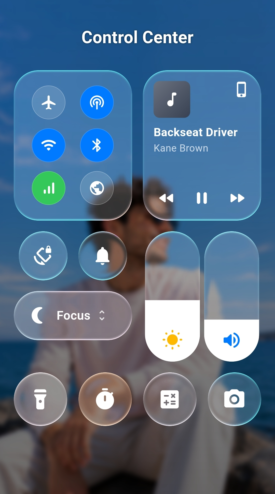
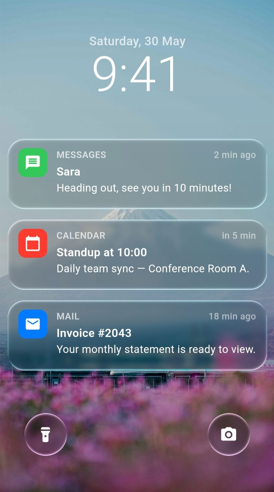
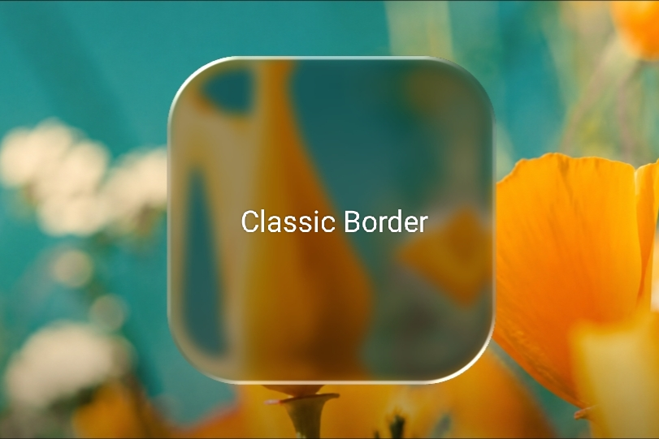
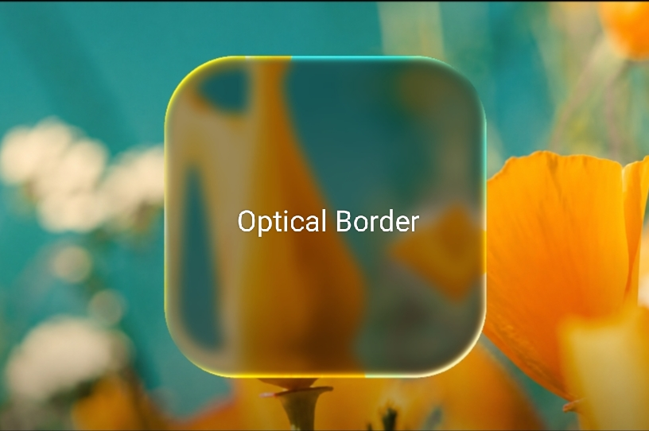

# Liquid Glass Easy

[](https://pub.dev/packages/liquid_glass_easy)

<p>
  🤝 <strong>Contributions are welcome!</strong>
</p>

**A Flutter package that adds real-time, interactive liquid glass lenses.**
These dynamic lenses can **magnify**, **distort**, **blur**, **tint**, and **refract** underlying content — creating stunning, glass-like effects that respond fluidly to **movement** and **touch**.

<p>
  
  
</p>

<p>
  
</p>

---

## What's New

- 🪟 **Optical border mode** — borders now ship with a new **`OpticalBorder`** style alongside the original `ClassicBorder`. It renders an Apple-style, SDF-based rim light that automatically picks up the background color through ambient tinting, with dual-sided specular highlights and a lens height profile. See [Border Modes](#border-modes) for details.
- 🧩 **New ready-made components** — drop-in glass UI widgets so you can compose interfaces faster:
  - `LiquidGlassButton`
  - `LiquidGlassSearchBar`
  - `LiquidGlassAppIcon`
  - `LiquidGlassDock`
  - `LiquidGlassTabBar`
  - `LiquidGlassBottomNavBar`

---

## Why Liquid Glass Easy?

Unlike traditional glassmorphism or static blur effects, **Liquid Glass Easy** simulates *real glass physics* — complete with **refraction, distortion, and fluid responsiveness**.
It captures and refracts live background content in real time, producing **immersive, motion-reactive visuals** that bring depth and realism to your UI.

---

## Features

- 💠 **True liquid glass visuals** — replicate the look and physics of real glass with fluid transparency, soft highlights, and refraction that bends light naturally through your UI.
- 🌀 **Real-time lens rendering** — see distortion, blur, tint, and refraction react instantly as elements move behind the glass.
- 🎨 **Custom shapes** — design lenses as rounded rectangles, circles, or smooth superellipses that perfectly match your interface style.
- 🌈 **Fully customizable effects** — control tint color, intensity, softness, refraction depth, and light direction for precise glass behavior.
- 🧠 **Controller-driven animations** — show, hide, or animate lenses in real time through the `LiquidGlassController`.
- ⚙️ **Shader-driven, GPU-accelerated pipeline** — ensures smooth, high-FPS performance even with multiple dynamic lenses.
- 📱 **Cross-platform compatibility** — works seamlessly on Android, iOS, Web, macOS, and Windows.

---

## Installation

Add the dependency:

```yaml
dependencies:
  liquid_glass_easy: ^2.0.0
```

Then run:
```bash
flutter pub get
```

---

## Getting Started

Check the `example/` directory for a complete, self-contained demo (Control Center, Notifications, and a draggable lens playground) you can run with `flutter run` or copy into your own project.
You can also try:
- `LiquidGlassShowcase` — a comprehensive demo widget that lets you explore all Liquid Glass Easy capabilities interactively. Adjust parameters such as distortion, blur, magnification, lighting, and border style in real time using intuitive sliders and toggles.
- `LiquidGlassPlayground` — an experimental environment where you can test your own widgets beneath a live liquid glass lens. Fine-tune visual parameters with built-in controls to instantly see how the effect adapts to different content and layouts.

<p>
  
</p>

> ⚠️ **Important Note:**  
> The `LiquidGlassShowcase` and `LiquidGlassPlayground` widgets are designed only for **previewing and copying slider values**.
>
> They are **not intended for performance benchmarking**, because the `backgroundWidget` is rendered at **half the screen height**, while the other half is used for sliders.
>
> For **accurate performance testing**, use the `LiquidGlassView` directly without these preview widgets.

**Basic setup with one lens:**

```dart
import 'package:flutter/material.dart';
import 'package:liquid_glass_easy/liquid_glass_easy.dart';

class DemoGlass extends StatelessWidget {
  @override
  Widget build(BuildContext context) {
    return Scaffold(
      body: LiquidGlassView(
        backgroundWidget: Image.asset('assets/bg.jpg', fit: BoxFit.cover),
        children: [
          LiquidGlass(
            width: 200,
            height: 100,
            magnification: 1,
            distortion: 0.1,
            distortionWidth: 50,
            position: LiquidGlassAlignPosition(alignment: Alignment.center),
          ),
        ],
      ),
    );
  }
}
```

---

## Border Modes

Every shape can render its border in one of two styles through the `borderType` parameter. Use **`ClassicBorder`** for a stylized sweep gradient with direct light/shadow color control, or **`OpticalBorder`** for an Apple-style, SDF-based rim light that picks up the background color through ambient tinting.

<p>
  
  
</p>

| Mode | Description |
|--------|-------------|
| `ClassicBorder` | Light and shadow colors sweep around the shape based on the angle between the surface normal and the light direction. Produces a clean, stylized border with direct control over light/shadow colors. |
| `OpticalBorder` | The border emerges as an optical consequence of the glass shape, using SDF-based rim lighting with background-tinted highlights, dual-sided specular reflections, and a lens height profile. Automatically picks up the background color through ambient tinting. |

### Classic Border

```dart
LiquidGlass(
  width: 200,
  height: 120,
  position: LiquidGlassAlignPosition(alignment: Alignment.center),
  shape: RoundedRectangleShape(
    lightColor: Color(0xB2FFFFFF),
    borderType: ClassicBorder(
      borderSoftness: 2.5,
      shadowColor: Color(0x1A000000),
    ),
  ),
)
```

| Property | Description |
|----------|-------------|
| `borderSoftness` | Controls the feathered edge transition. Higher values produce a softer border; lower values keep it crisp. Defaults to `1.0`. |
| `shadowColor` | The shadow color used on the opposite side of the lens border to enhance depth and contrast. Defaults to `Color(0x1A000000)`. |

### Optical Border

```dart
LiquidGlass(
  width: 200,
  height: 120,
  position: LiquidGlassAlignPosition(alignment: Alignment.center),
  shape: RoundedRectangleShape(
    borderType: OpticalBorder(
      borderSaturation: 1.5,
      ambientIntensity: 1.0,
      borderSolidity: 0.0,
    ),
  ),
)
```

| Property | Description |
|----------|-------------|
| `borderSaturation` | Saturation boost applied to the final border color. `0.0` is grayscale, `1.0` is unchanged (default), `>1.0` is more vivid. Recommended range: `0.0`–`3.0`. |
| `ambientIntensity` | Ambient lighting contribution to the rim, keeping it visible even on the shadow side. `0.0` is none, `1.0` is the default gain, `>1.0` washes around the entire rim. Recommended range: `0.0`–`5.0`. |
| `borderSolidity` | How much `lightIntensity` can push the rim toward a fully opaque look. `0.0` keeps it translucent (default), `1.0` allows a light-driven solid rim. Recommended range: `0.0`–`1.0`. |

> **Tip:**  
> `borderType` defaults to `OpticalBorder()`. The optical mode always applies ambient tinting from the background, so the rim color adapts to whatever sits behind the lens.

---

### Refraction Modes

  <p>
  
  
</p>

| Mode | Description |
|--------|-------------|
| `shapeRefraction` | Refracts light based on the underlying shape geometry, following the contours of the glass for more physically accurate distortion. |
| `radialRefraction` | Refracts light radially from a central point, creating a circular distortion pattern. |

---

## Common Use Cases

### Multiple Lenses
```dart
LiquidGlassView(
  backgroundWidget: YourBackground(),
  children: [
    LiquidGlass(
      width: 160,
      height: 160,
      distortion: 0.15,
      distortionWidth: 50,
      position: LiquidGlassOffsetPosition(left: 40, top: 100),
    ),
    LiquidGlass(
      width: 220,
      height: 120,
      distortion: 0.075,
      magnification: 1,
      distortionWidth: 40,
      position: LiquidGlassAlignPosition(alignment: Alignment.bottomRight),
      blur: LiquidGlassBlur(sigmaX: 1, sigmaY: 1),
      color: Colors.white30,
    ),
  ],
);
```

### Draggable Lens

<p>
  
</p>

```dart
LiquidGlass(
  draggable: true,
  width: 200,
  height: 120,
  position: LiquidGlassAlignPosition(alignment: Alignment.center),
)
```

### Lens with Overlay Content
```dart
LiquidGlass(
  width: 200,
  height: 120,
  position: LiquidGlassAlignPosition(alignment: Alignment.center),
  child: Center(child: Icon(Icons.search, color: Colors.white)),
)
```

### ⚠️ Important Note

The child widget inside `LiquidGlass` always takes the **full size of the lens**.

If you want to reduce the child’s visible area, wrap it with your own `Padding`:

```dart
LiquidGlass(
  child: Padding(
           padding: EdgeInsets.all(12),
           child: YourWidget(),
  ),
)
```

---

## Positions & Shapes

<p>
  
</p>

### Position Types
| Class | Description |
|--------|-------------|
| `LiquidGlassOffsetPosition` | Uses pixel offsets: `left`, `top`, `right`, `bottom`. |
| `LiquidGlassAlignPosition` | Uses `alignment` with optional `margin`. |

### Shape Types
| Class | Description |
|--------|-------------|
| `RoundedRectangleShape` | Use `cornerRadius`. |
| `SuperellipseShape` | Use `curveExponent`. |

---

### Chromatic Aberration

  

| Property | Description |
|----------|-------------|
| `chromaticAberration` | Controls the intensity of the chromatic aberration effect applied to the lens. Higher values increase the separation of color channels, producing a stronger rainbow-like distortion. |

> **Tip:**  
> The default value is `0.003`.  
> Setting it to `0.0` disables the chromatic aberration effect entirely.  
> Use this property to add subtle or exaggerated color distortion for a more realistic or stylistic glass effect.
---

## Show/Hide Lens with Controller (Animated)

```dart
final lensController = LiquidGlassController();

LiquidGlass(
  controller: lensController,
  position: LiquidGlassAlignPosition(alignment: Alignment.center),
);

// Later
lensController.hideLiquidGlass(animationTimeMillisecond: 300);
lensController.showLiquidGlass(animationTimeMillisecond: 300);
```

Toggle real-time capturing:
```dart
if (isVisible = (!isVisible)) {
  viewController.startRealtimeCapture();
  lensController.showLiquidGlass!();
} 
else {
  lensController.hideLiquidGlass!(
  onComplete: viewController.stopRealtimeCapture,
  );
}
```

---

## Snapshot vs Realtime

| Mode | When to Use | Config |
|-------|--------------|--------|
| **Realtime** | For moving backgrounds (scrolling, videos) | `realTimeCapture: true` |
| **Snapshot** | For static backgrounds | `realTimeCapture: false` + `captureOnce()` |

**Example:**
```dart
final viewController = LiquidGlassViewController();

LiquidGlassView(
  controller: viewController,
  backgroundWidget: ...,
  realTimeCapture: false,
  children: [...],
);

// Refresh manually
await viewController.captureOnce();
```

---

## Recommended Settings

- **General use:**
  `useSync: true`, `pixelRatio: 0.8–1.0`
- **Performance-focused:**
  `useSync: false`, `pixelRatio: 0.5–0.7`

> If your background is full-screen, a pixel ratio of 0.5–1.0 gives the best trade-off between performance and detail.
> For smaller regions, higher pixel ratios yield sharper glass.
> This is a general guideline — the final choice depends on the device’s performance.

---

## Key API (Quick Reference)

### `LiquidGlassView`
```dart
LiquidGlassView({
  required Widget backgroundWidget,
  required List<LiquidGlass> children,
  double pixelRatio = 1.0,
  bool realTimeCapture = true,
  bool useSync = true,
  LiquidGlassRefreshRate refreshRate = LiquidGlassRefreshRate.deviceRefreshRate,
})
```

### `LiquidGlass`
```dart
LiquidGlass({
  double width = 200,
  double height = 100,
  double magnification = 1.0,
  double distortion = 0.125,
  bool draggable = false,
  required LiquidGlassPosition position,
  Widget? child,
  Color color = Colors.transparent,
})
```

---

## License
**MIT License**

---

## Author

**Ahmed Gamil**

Feel free to open issues or contribute to the project!